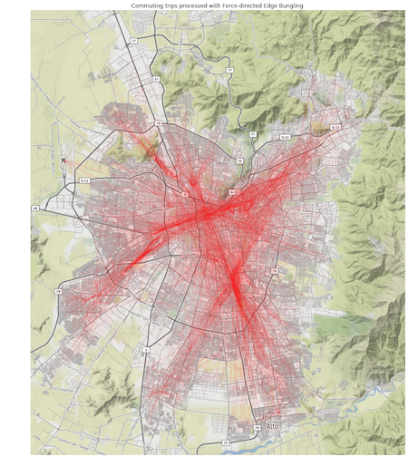

# python.ForceBundle

#### Python / numba Force-directed Edge Bungling


## Description

#### Edge Bundling Algorithms (What Do They Do)
Node-link graphs with many edges and nodes suffer from visual clutter, edge-bundling algorithms transform and group the edges of a node-link graph in such a way as to improve the readability of the diagram. The process is for example analogous to bundling network cable wires along their route in order have a clear understanding of the links between entities and structural patterns of the network. There are several algorithms in this class, from ones that use hidden user-defined meshes to control the bundling **[1]**, to case specific ones such as for hierarchical data **[2]** and finally to self-organizing methods based on physical force interaction simulations **[3]**.

#### Force Edge Bundling
**Force edge bundling** **[3]** works by modelling edges between nodes as flexible springs which can attract each other if certain geometrical compatibility criterions are met. 
The input for the algorithm is a simple node-link diagram of a graph with nodes and edges. In order to change the shape of the basic straight line edges between nodes, the algorithm proceeds by subdividing edges into segments. Attraction *spring* forces are simulated between each pair of consecutive subdivision points on the same graph-edge. Moreover, attraction *electrostatic* forces are computed between subpoints of different edges which are geometrically compatible. The combined force acting on each subdivision point is computed and the points are moved a certain step size in the direction of the force. The force-simulation on these sub-points is repeted a certain amout of iterations. After the end of a cycle of iterations the resulting graph-edges are divided again in smaller segements and the whole process repeats itself until the end cycle is reached. It's important to note that the position of original node-points are fixed throughout the simulation.

#### Parameters Tuning
##### Fixed Parameters 
A certain number of parameters have been fixed to specific optimized values as found through experimentation by the authors. These include the spring constants **K** (=0.1), which controls the amount of bundling by controling the stiffness of edges. The number of iterations for simulating force interactions **I** (=60) and the number of cycles of subdivision-force simulation iterations **C** (=6). Moreover, the initial number of division points **P** is set to 1 and the rate at which it increases set to 2. The rate of the number of iterations **I** decreases each cycle is set to **2/3**.
All these parameters can be changed nonetheless if really needed by using the following methods:

- *bundling_stiffness ([new bundling stiffness: float value])*
- *iterations([new number of iterations to execute each cycle: int value])*
- *iterations_rate([new decrease rate for iteration number in each cycle: float value])*
- *cycles ([new number of cycles to execute: int value])*
- *subdivision_points_seed([new number subdivision points in first cycle: int value])*
- *subdivision_rate([new rate of subdivision each cycle: float value])*

##### Tuning Parameters For Your Specific Graph

Two parameters are **essential** for tuning the algorithm to produce usable diagrams for your graph. These are the geometric **compatibility score** above which pairs of edges should be considered compatible (default is set to 0.6, 60% compatiblity). The value provided should be between 0 and 1. Passing the new value to the  ***compatbility_threshold*** method will set the new threshold.

The **most important parameter** is the **initial step size** used to move the subdivision points after forces have been computed. This depends on both the scale of the graph and the number of edges and nodes contained. Having a step size which is too low will produce node-link like graphs while too high values will over distort edges. This can be set using the ***step_size*** function and passing your new step float size value. The default value is set to **0.1**.


## Usage
Check ```example.ipynb``` for a full example from data to plot.

## Debugging
### Fixing crashes checklist

 - Be sure you edges are going trough ```is_long_enough(edge)``` or an equibalent (if you using ```array2edges```, it does it for you)
 - May be the float point:
  1. Set ```FASTMATH=False```
  2. If still fails try replacing jit spec at ```Point``` class from: 
  ```Python
@jitclass([('x', float32), ('y', float32)])
```
to:
```Python
@jitclass([('x', float64), ('y', float64)])
```

### General debugging advice 
[Numba](https://numba.pydata.org/) function are opaque and big datasets are slow to process without. Mi advice is to attack on both fronts:

 1. Try to slice you edges until you you have a reasonable amount to process without numba , something like:
    ```Python
     slide = data[:1000]
     # If don't crash then try:
     slide = data[1000:2000] 
     ```
 2. Go commenting the ````@jit```` line on the chain of functions until you find the issue on plain python


## beloved _js_ ancestor
This implementation it's a port to _numba_ from un-usably-slow native _python_ implementation which was a port of [a _d3 js_ implementation](https://github.com/upphiminn/d3.ForceBundle).

I tried to keep structure as close as possible, so bug fixes can be easily ported in both ways.
